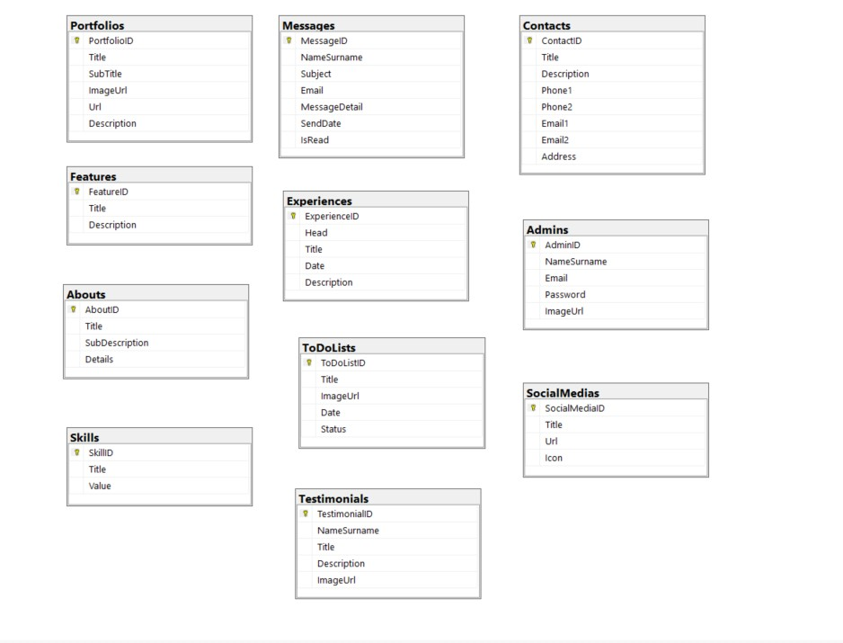
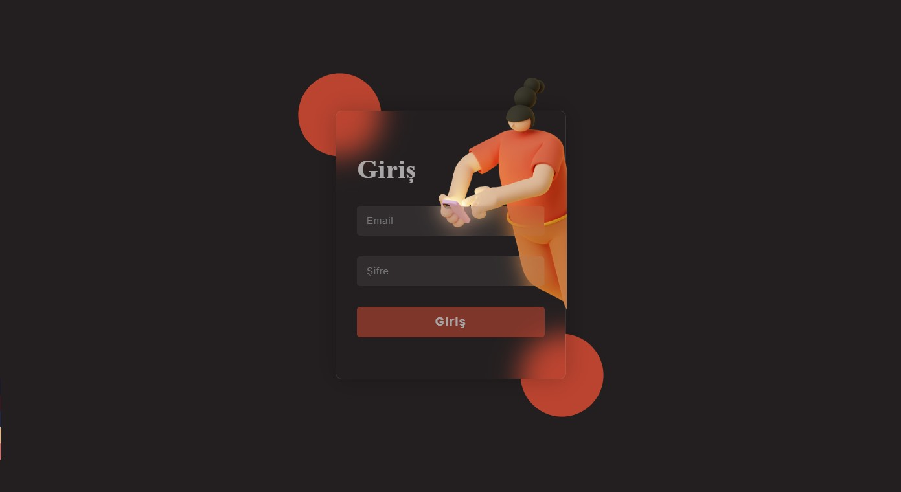
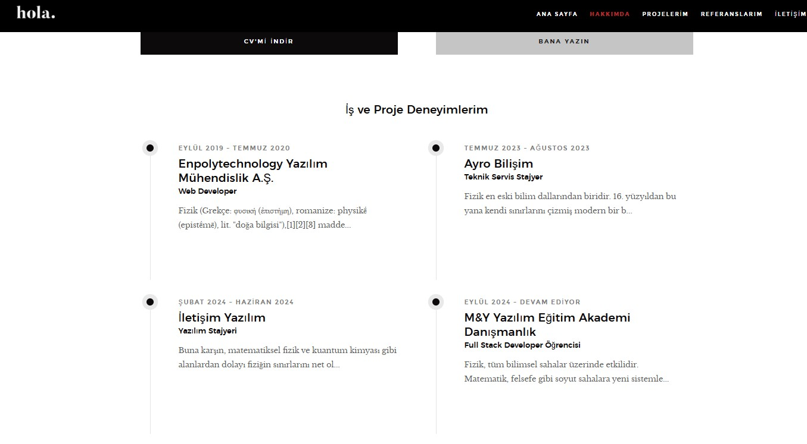
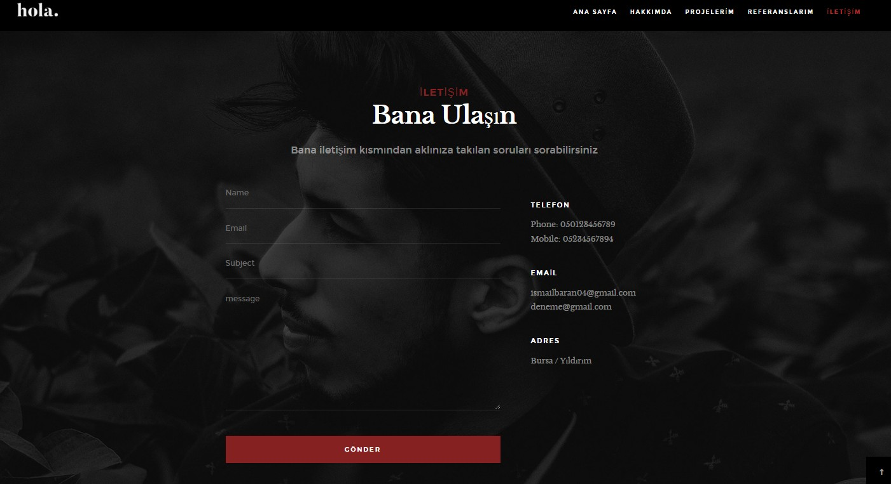
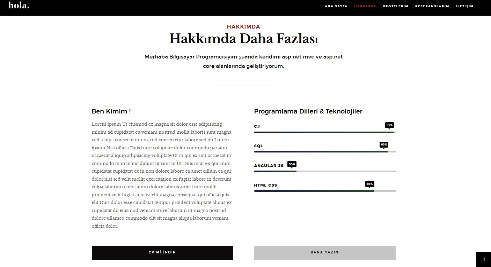
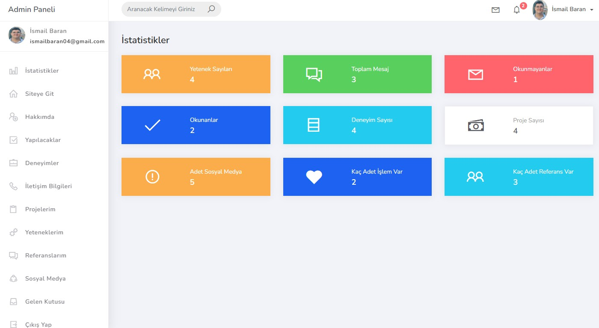
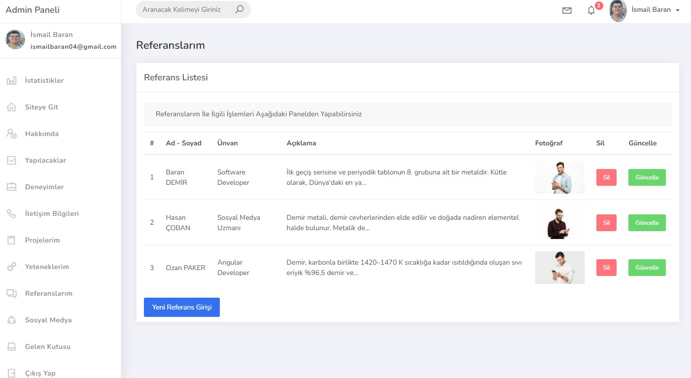
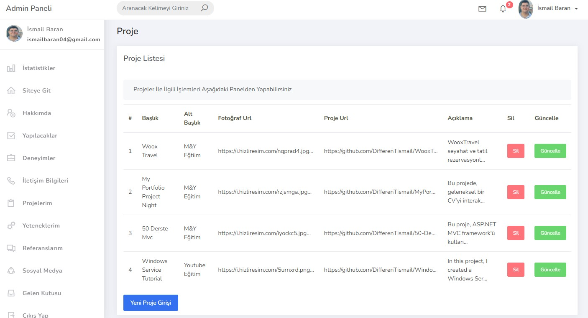
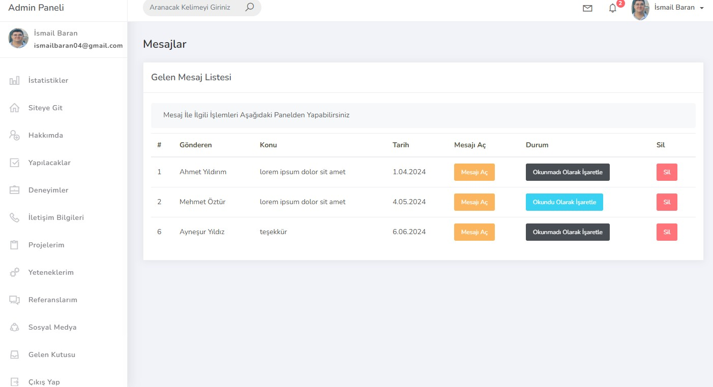
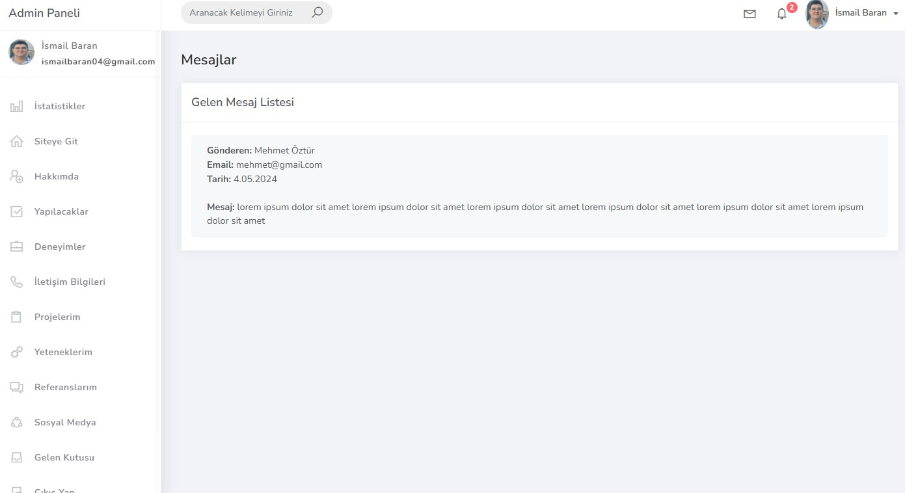

👋 Herkese Merhaba,

M&Y Yazılım Eğitim Akademi Danışmanlık bünyesinde, Murat Yücedağ hocamın **"Full Stack .Net Core Development"** eğitimi kapsamında, Udemy üzerinden ücretsiz olarak yayınladığı **"Asp.Net Core ile Portfolyo Uygulamanızı Geliştirin"** eğitimini tamamladım! 🎉

### Proje Amacı 🎯
Bu projede, kişisel portföylerinizi sergileyebileceğiniz, içeriklerinizi dinamik olarak yönetebileceğiniz ve kullanıcı oturumlarını güvenli bir şekilde yönetebileceğiniz modern bir web uygulaması geliştirmeyi amaçladım. Özellikle yazılım geliştirenler için kişisel projelerini ve deneyimlerini sergileyebileceği bir platform oluşturmayı hedeflendim.


### Öne Çıkan Özellikler 🚀  
- **Oturum Yönetimi ve Çerezler** 🍪: 30 dakikalık güvenli oturum süresi.  
- **Partial Component Kullanımı**: Dinamik ve modüler içerik yapısı.  
- **Code First ile Veritabanı Yönetimi** 🗄️: Entity Framework ile esnek veri yapısı.  
- **Modern Tasarım**: Mobil uyumlu ve estetik arayüz.  

### Kullanılan Teknolojiler 🛠️  
- **ASP.NET Core**  
- **Entity Framework - Code First** 🗄️  
- **Session ve Cookie Yönetimi** 🔐  
- **Bootstrap 5** 🎨  

## Ekran Görüntüleri

### Veri Tabanı


### Login Sayfası


### UI Sayfası Görüntüleri





### Admin Paneli Görüntüsü






## Kurulum ⚡
1. Projeyi klonlayın.
   ```bash
   git clone https://github.com/DifferenTismail/MyPortfolioUdemy.git
2. Proje klasörüne gidin:
    ```bash
    cd MyPortfolioUdemy

3. Veritabanı yapılandırmalarını yapın ve SQL Server üzerinde çalıştırın.

4. Uygulamayı çalıştırın:
    ```bash
    dotnet run

## Katkıda Bulunma

Katkıda bulunmak isterseniz, lütfen bir **pull request** açın. Her türlü katkı memnuniyetle karşılanır.
